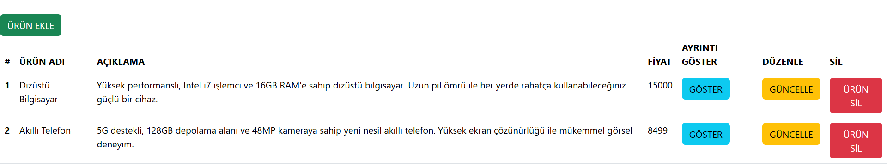
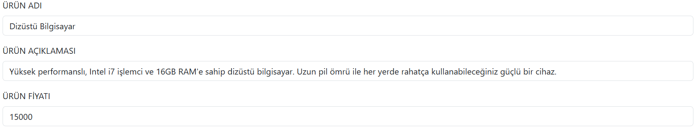
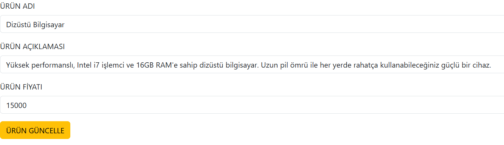

# 🛠️ Laravel CRUD Projesi

Bu proje, **Laravel** framework’ü ile geliştirilmiş basit bir CRUD (Create, Read, Update, Delete) uygulamasıdır. Kullanıcılar ürün ekleyebilir, düzenleyebilir, görüntüleyebilir ve silebilir. Proje, Laravel’in MVC mimarisi ve Eloquent ORM yapısı kullanılarak geliştirilmiştir.  

## 📋 Özellikler  
- ✅ **Ürün Ekleme**  
- ✏️ **Ürün Güncelleme**  
- 🗑️ **Ürün Silme**  
- 🔍 **Ürünleri Listeleme**  
- 🛠️ **Veritabanı İşlemleri (MySQL)**  

## 🔧 Kullanılan Teknolojiler  
- **Laravel** – PHP framework  
- **MySQL** – Veritabanı yönetimi  
- **Bootstrap** – Basit ve şık arayüz tasarımı  
- **Laravel Blade** – Arayüz şablonlama  

## 📸 Ekran Görüntüleri  

### 📝 Ürün Listeleme  
  

### ➕ Ürün Ekleme  
  

### ❌ Ürün Silme  
  
